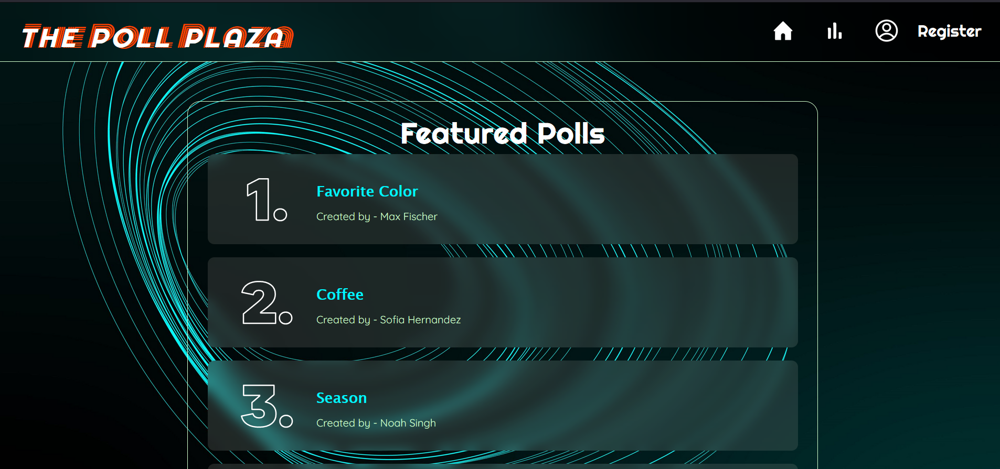
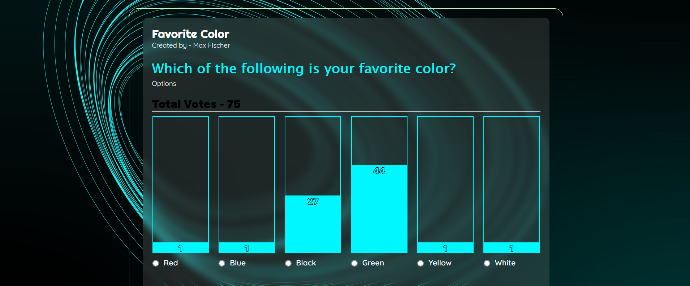
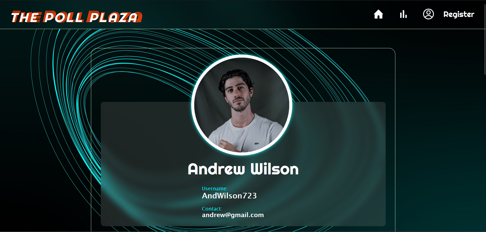
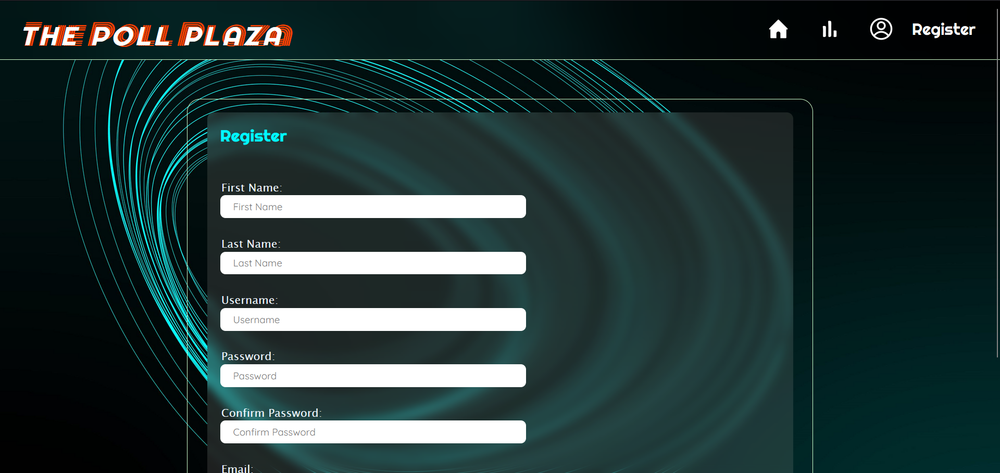
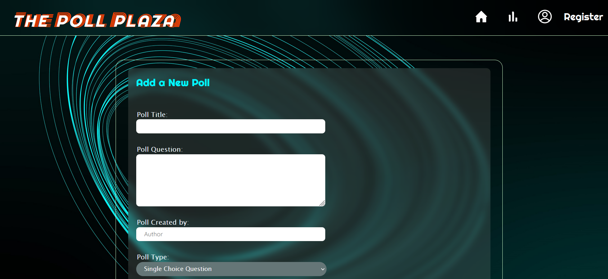

# Polling Website

## Instructions to Run Locally

### Prerequisites
Make sure you have the following installed on your system:
- Node.js
- Python (for Django)

### Frontend Setup
1. Navigate to the `frontend_react` folder.
2. Run the following command to install the required dependencies:
   npm install
3. After the installation is complete, start the frontend server with the following command:
   npm run start
This will run the frontend on `http://localhost:3000/`.

### Backend Setup
1. Navigate to the `backend_django` folder.
2. Run the following command to install the required Python dependencies:
   pip install -r requirements.txt
3. After the installation is complete, start the Django development server with the following command:
   python manage.py runserver
This will run the backend on `http://localhost:8000/`.

### Accessing the Website
Once both the frontend and backend servers are running, you can access the polling website by visiting `http://localhost:3000/` in your web browser.

